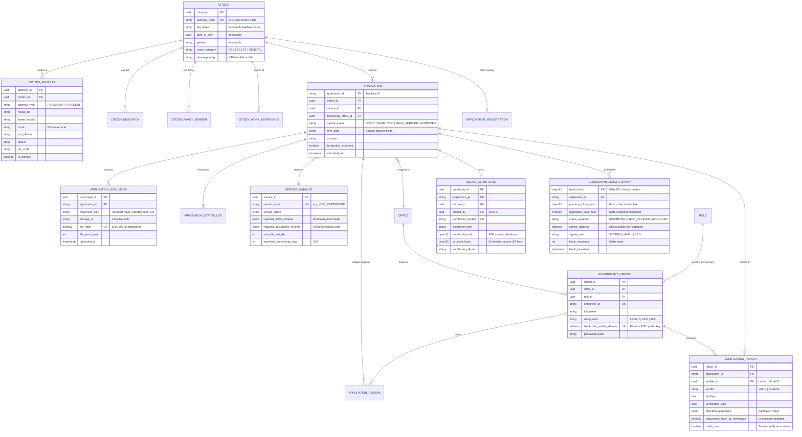

# e-Seba Database Schema & Hybrid Ledger Map

This document maps out the entity relationships and data architecture for the **e-Seba Anti-Corruption Platform**. The system uses a **hybrid database-ledger architecture** where standard relational tables store active operational states, while an append-only cryptographic block ledger secures status transitions and document fingerprints to prevent tampering and historical manipulation.

---

## 1. Entity-Relationship (ER) Map

The following Mermaid diagram visualizes the relational links across the **Citizen**, **Application**, **Administrative/Official**, **Verification/Certificate**, and **Blockchain Ledger** domains.



---

## 2. Table Domains & Relationships

### Domain 1: Citizen Identity Profile
Holds the citizen's personal record, address locations, family structures, languages, and qualifications. 
* **Immutable Anchoring**: Upon Aadhaar/OTP verification, a `CITIZEN` record is created. Primary fields (`full_name`, `date_of_birth`, `gender`, `aadhaar_hash`) are locked from the simulated UIDAI database and cannot be updated.
* **Relations**: `CITIZEN` is the parent table for `CITIZEN_ADDRESS` (1-to-many), `CITIZEN_EDUCATION` (1-to-many), `CITIZEN_FAMILY_MEMBER` (1-to-many), `CITIZEN_WORK_EXPERIENCE` (1-to-many), and `CITIZEN_LANGUAGE` (1-to-many).

### Domain 2: Ingestion & Document Verification
Manages the submit lifecycle, catalog specifications, and physical document checksum verification.
* **Schemas**: `SERVICE_CATALOG` defines the mandatory fields and uploads requirements as Pydantic-validated JSON schemas.
* **Drafts**: A new `APPLICATION` is initialized in `DRAFT`. Every file uploaded adds a row in `APPLICATION_DOCUMENT`, computing a SHA-256 `file_hash` of its raw binary.
* **Sealing**: When all catalog documents are uploaded, the aggregate fingerprint of all files is anchored in the ledger, and status changes from `DRAFT` to `SUBMITTED`.

### Domain 3: Administrative Control & Queues
Encompasses the government organizational hierarchy, roles, and officials credentials.
* **Offices**: `OFFICE` holds SDO and Circle offices. `GOVERNMENT_OFFICIAL` contains officials linked to a specific `OFFICE` and assigned a `ROLE` (e.g. `REVENUE_LAMBU` or `SDO`).
* **Wallet Signatures**: Each official has a `blockchain_wallet_address` simulating a physical hardware **Digital Signature Certificate (DSC)** token key used to cryptographically sign transaction blocks.

### Domain 4: Inspection & Digital Issuance
Contains verification outcomes and final certificates minted.
* **Field Verification**: A `VERIFICATION_REPORT` records the Lambu's physical inspect outcomes, checklist flags, and a re-computed `documents_hash_at_verification`. If files on disk differ from the genesis block state, `hash_match` is marked `False` (tamper warning).
* **Minting**: An `ISSUED_CERTIFICATE` is generated upon approval. It computes a unique QR verification hash (`qr_code_hash`) linking directly to the public audit ledger URL, preventing forgery.

### Domain 5: The Immutable Blockchain Ledger
Stores sequential ledger entries linked chronologically.
* **Table**: `BLOCKCHAIN_LEDGER_ENTRY`.
* **State Transition Blocks**:
  1. **Block Index 1 (GENESIS)**: Minted when the citizen completes document uploads. Records initial aggregate document hashes. `previous_block_hash` is `NULL`.
  2. **Block Index 2 (FIELD_VERIFIED)**: Minted when Circle Lambu submits a verification report. `previous_block_hash` points to Block 1.
  3. **Block Index 3 (APPROVED/REJECTED)**: Minted when SDO/SDC magistrate signs the final decision. `previous_block_hash` points to Block 2.

---

## 3. Cryptographic Chain Link & Anti-Tamper Mechanism

The database ledger implements a backward-linked cryptographic chain to guarantee complete immutability:

```
+------------------------------------+      +------------------------------------+      +------------------------------------+
|            BLOCK #1                |      |            BLOCK #2                |      |            BLOCK #3                |
|            (Genesis)               |      |          (Verification)            |      |           (Issuance)               |
+------------------------------------+      +------------------------------------+      +------------------------------------+
| Block Index: 1                     |      | Block Index: 2                     |      | Block Index: 3                     |
| Prev Hash:   NULL                  |      | Prev Hash:   0x7f3a8b...           |      | Prev Hash:   0x2c9d6f...           |
| Doc Hash:    0xABCD... (Files)     |      | Doc Hash:    0xABCD... (Check)     |      | Decision:    ISSUE                 |
| Signee:      System Gateway        |      | Signee:      Lambu Wallet (DSC)    |      | Signee:      SDO Wallet (DSC)      |
| Block Hash:  0x7f3a8b...           |----> | Block Hash:  0x2c9d6f...           |----> | Block Hash:  0x5a1e8d...           |
+------------------------------------+      +------------------------------------+      +------------------------------------+
                                                                                                           ^
                                                                                                           |
                                                                                                Links to Issued Certificate
```

### How Tampering is Prevented:
1. **Historical Edits**: If an attacker attempts to modify an application status or change official decisions directly in the SQLite database, the `block_hash` sequence breaks. A sequential recalculation of block hashes (`verify_ledger_integrity`) will detect the checksum mismatch.
2. **File Swapping**: If someone logs onto the server and replaces an uploaded PDF certificate or application document with a forged one, the file's SHA-256 hash on disk will change. When Lambu or the system checks the file, the current hash will fail to match the aggregate hash anchored in Block #1, triggering a `DATA_TAMPERING` fault block.
3. **Backdated Approvals**: The ledger timestamp and sequence indexes are cryptographically sealed in the block hash. Since block sequences are linked using the hash of the preceding block, inserting or backdating a block breaks the chain structure.
